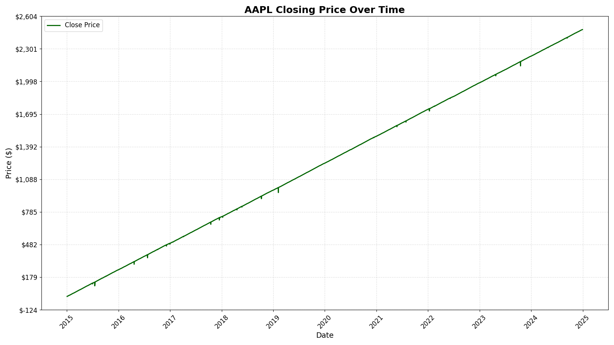
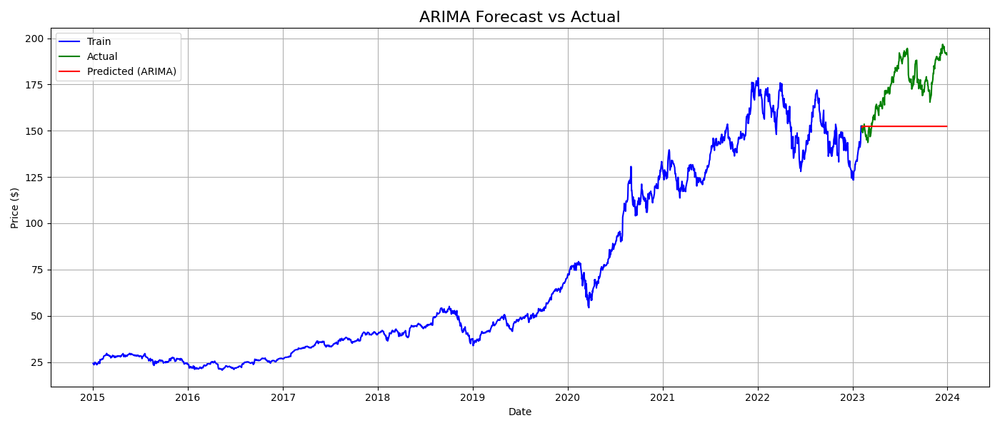

# # 📈 Stock Market Time Series Forecasting (ZIDIO Internship Project)

This project demonstrates *Time Series Analysis and Forecasting* using Apple Inc. (AAPL) stock data. It includes steps from data collection to visualization and ARIMA-based forecasting.

> 🧠 Built as part of an internship at *Zidio Development*.

---

## 📁 Project Structure

ZIDIO/
├── data/
│ └── AAPL_stock.csv
├── notebooks/
│ ├── 1_data_collection.py
│ ├── 2_preprocessing_visuals.py
│ └── 3_arima_forecasting.py
├── visuals/
│ ├── close_price_plot.png
│ └── arima_forecast.png
├── .venv/
---

## 📌 Key Features

- ⬇ Download historical stock data using yfinance
- 🧹 Clean and process time series data using pandas
- 📊 Visualize trends using matplotlib
- 📈 Apply *ARIMA* model to forecast next 30 days
- 🖼 Save plots inside visuals/ for easy sharing and reporting

---

## 🖼 Output Visualizations

### AAPL Closing Price Over Time

### ARIMA-Based Forecast

---

## ⚙ How to Run in VS Code

1. *Open project in VS Code*

2. *Create and activate virtual environment (optional but recommended)*

Install required libraries
pip install yfinance pandas matplotlib statsmodels
Run scripts in order
# Step 1: Download stock data
python notebooks/1_data_collection.py

# Step 2: Preprocess and visualize closing price
python notebooks/2_preprocessing_visuals.py

# Step 3: Forecast using ARIMA
python notebooks/3_arima_forecasting.py

🛠 Tech Stack
Python

yFinance

pandas

matplotlib

statsmodels (ARIMA)

Visual Studio Code (VS Code)
